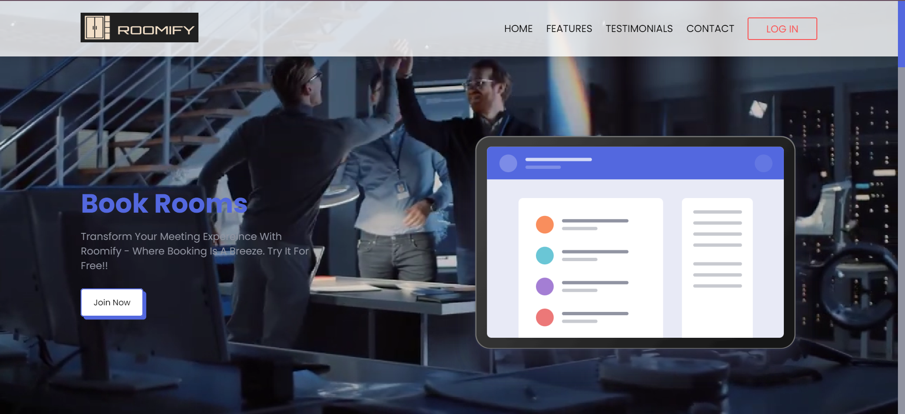

# Project Title

## Overview

This project is a comprehensive user and room management system that includes functionalities for managing users, creating and editing meeting rooms, booking meeting rooms, and viewing meetings. The system features distinct roles (Admin, Manager, Member) with specific capabilities and permissions.

## Steps to Run the Project

1. **Open the Project:**

   - Open the project at the root level.

2. **Navigate to the Homepage:**

   - Go to the `Homepage` folder located at `application/FrontEnd/Homepage`.

3. **Open the Index File:**

   - Find the `index.html` file and open it.

4. **Start the Application:**

   - Click on **Go Live** to run the project.

5. **Login as Admin:**

   - On the homepage, click on **Login**.
   - Use the following credentials to log in as an admin:
     - **Email:** bilal.admin@gmail.com
     - **Password:** admin123.

6. **Import Users:**

   - On the admin dashboard, click on **Import Users**.

7. **Refresh the Application:**

   - On successful import, refresh the application to see the **Manage Users** button.

8. **Manage Users:**

   - Click on **Manage Users** to see the default imported users.

9. **Explore the Application:**
   - Explore the rest of the application for manager and member users.

## Features and Functionalities

### User Management

- **Admin Role:**

  - The admin can import users from an XML file, manage users (edit/delete), and create or edit meeting rooms.
  - Only the admin can see the **Manage Users** button, which leads to a page displaying all users with options to edit or delete them.

- **Manager Role:**

  - The manager can book meeting rooms, view all rooms, and manage meetings.
  - The manager has access to a **Manage Meetings** page where ongoing and completed meetings are displayed.

- **Member Role:**
  - The member can participate in meetings but has limited access to room booking or management functionalities.

### Room Management

- **Create and Edit Rooms:**
  - The admin can create or edit rooms with predefined amenities.
  - The form for creating/editing rooms includes checkboxes for amenities like Projector, Wifi Connection, Conference Call Facility, etc.
  - Rooms are stored in local storage, and each room has a unique ID, capacity, and associated costs.

### Booking System

- **Book Meeting Room:**

  - Managers can book meeting rooms using a form that includes fields for duration, selected users, additional amenities, and meeting type.
  - The total cost is dynamically calculated based on room capacity, duration, and extra amenities requested.
  - The meeting details are stored in local storage and can be viewed on the **View Meetings** page.

- **Meeting Types:**
  - The booking form includes a **Meeting Type** field with options for Classroom Training, Online Training, Conference Call, and Business Meeting.

### View Meetings Page

- **Display Meetings:**
  - The meetings page displays a table of meetings with filtering options based on room name, status, and date.
  - The **Duration** column includes sorting functionality with ascending, descending, and default order toggles.
  - Each meeting row includes a modal for detailed information.

### Authentication

- **Login System:**
  - The application includes a login system where users are authenticated based on their role.
  - Logged-in users are redirected to their respective dashboards based on their role.

### Weekly Credits Reset

- **Manager Credits Reset:**
  - Every Monday, the system automatically resets the credits for all users with the **Manager** role back to 2000.
  - This feature ensures that managers start each week with a consistent budget for booking meeting rooms.

### User Import

- **Import Users:**
  - Users are imported from an XML file and stored in local storage.
  - The import functionality is available only to the admin, and once users are imported, the import button disappears.

## Future Scope and Improvements

- **User Roles Expansion:**

  - Additional user roles can be introduced with varying levels of access and permissions.

- **Room and Meeting Reports:**

  - Generate reports for room utilization, meeting frequency, and user participation.

- **Email Notifications:**

  - Implement email notifications for booking confirmations, meeting reminders, and user updates.

- **Integration with External Calendars:**

  - Integrate the system with external calendars (e.g., Google Calendar) for automatic meeting scheduling.

- **Enhanced UI/UX:**

  - Improve the user interface and experience with more animations, transitions, and responsive design elements.

- **Backend Integration:**
  - Integrate the front-end with a backend service for persistent data storage and retrieval, moving beyond local storage.

## Conclusion

This project provides a robust platform for managing users, meeting rooms, and bookings with a user-friendly interface and clear role-based access control. Future enhancements will further expand its capabilities and improve the overall user experience.
